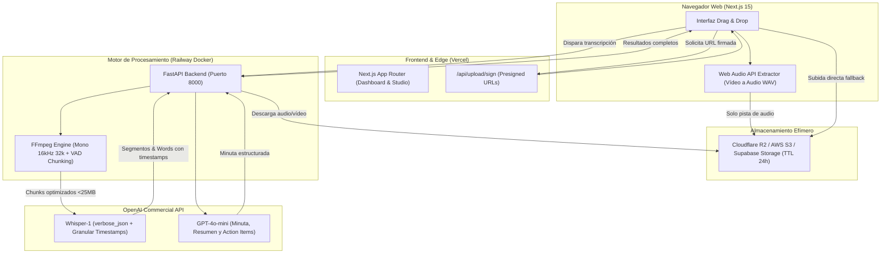

# Transcriptor Enterprise 🎙️⚡

Herramienta interna corporativa de alta seguridad para la conversión, transcripción y síntesis inteligente de archivos de audio y vídeo mediante la API comercial de OpenAI, optimizada para el stack **Vercel + Railway + OpenAI**.

---

## 🚀 Características Principales

- **Arquitectura Híbrida Inteligente (Bypass de Límites Serverless):**
  - **Extracción de audio en el navegador (Web Audio API):** Si el usuario sube un vídeo de 1 GB, el navegador extrae la pista de audio antes de transferir, reduciendo el tamaño a **~20-30 MB** (ahorro del 95% de ancho de banda).
  - **Presigned URLs (S3 / Cloudflare R2):** Carga directa desde el cliente sin pasar por Vercel (eludiendo el límite de 4.5 MB de Serverless).
- **Procesamiento de Audio Profesional (FFmpeg en Railway):**
  - Conversión a **Mono 16kHz a 32 kbps** (perfil óptimo de voz).
  - 1 hora de reunión = **~14 MB** (el 90% de las reuniones no requieren fragmentación ya que caben bajo los 25 MB de OpenAI).
  - **Smart Chunking con VAD (Voice Activity Detection):** Detección de silencios (`silencedetect`) para audios de >2 horas, asegurando cortes sin romper oraciones y calculando offsets milimétricos.
- **Suite de Exportación Completa:**
  - **`.SRT`**: Estándar SubRip para Adobe Premiere, DaVinci Resolve y Final Cut Pro.
  - **`.VTT`**: Estándar WebVTT para reproductores web y LMS.
  - **`.TXT`**: Texto plano con párrafos limpios por pausas de conversación.
  - **`.JSON`**: Metadatos completos con tiempos a nivel de palabra y segmento.
- **Studio Interactivo Sincronizado:**
  - Reproductor de audio integrado donde hacer clic en cualquier palabra o segmento salta al segundo exacto.
  - Modo edición en línea para corrección inmediata de nombres propios o erratas.
  - Búsqueda en tiempo real dentro del audio.
- **Minuta y Acuerdos IA con `gpt-4o-mini`:**
  - Generación de resumen ejecutivo, decisiones clave y tabla de tareas/acuerdos con responsables y plazos.
- **Seguridad y Cumplimiento Empresarial (Zero Data Retention):**
  - Uso exclusivo de la API comercial de OpenAI (no utilizada para entrenamiento de modelos).
  - Eliminación automática de archivos temporales inmediatamente tras procesar y TTL de 24 horas en bucket.

---

## 🏗️ Diagrama de Arquitectura



---

## 📦 Estructura del Repositorio

```
transcriptor/
├── backend/
│   ├── audio_processor.py   # Motor FFmpeg, compresión a 32kbps y VAD silence chunking
│   ├── transcriber.py       # Cliente OpenAI Whisper con verbose_json y alineación temporal
│   ├── summarizer.py        # Generador de minuta y acuerdos con gpt-4o-mini
│   ├── storage.py           # Cliente S3 / Cloudflare R2 con Presigned URLs
│   ├── config.py            # Configuración y variables de entorno Pydantic
│   ├── main.py              # Endpoints FastAPI y tareas en background
│   ├── Dockerfile           # Imagen Docker optimizada con FFmpeg para Railway
│   ├── railway.json         # Configuración de despliegue en Railway
│   ├── requirements.txt     # Dependencias Python
│   └── tests/               # Tests unitarios y de integración con pytest
├── frontend/
│   ├── app/
│   │   ├── page.tsx         # Orquestador del flujo y estados de procesamiento
│   │   ├── layout.tsx       # Layout principal
│   │   └── globals.css      # Estilos Tailwind CSS
│   ├── components/
│   │   ├── Navbar.tsx       # Barra de navegación con indicadores de seguridad
│   │   ├── UploadZone.tsx   # Zona Drag & Drop con selector de idioma y glosario
│   │   ├── ProgressTracker.tsx # Barra de progreso con etapas animadas
│   │   └── TranscriptionStudio.tsx # Studio con reproductor sincronizado y exportador
│   ├── lib/
│   │   ├── audioExtractor.ts # Extractor cliente con Web Audio API
│   │   └── types.ts         # Tipos TypeScript compartidos
│   └── package.json
└── README.md
```

---

## 🛠️ Guía de Ejecución en Local

### 1. Requisitos Previos
- Node.js >= 18
- Python >= 3.11
- FFmpeg instalado localmente (`brew install ffmpeg` en macOS o `apt install ffmpeg` en Ubuntu)

### 2. Levantar el Backend (FastAPI)
```bash
# Crear entorno virtual e instalar dependencias
uv venv .venv --python 3.12
source .venv/bin/activate
uv pip install -r backend/requirements.txt

# Configurar variables de entorno
cp backend/.env.example backend/.env
# Edita backend/.env e introduce tu OPENAI_API_KEY

# Ejecutar el servidor backend
cd backend
python -m uvicorn main:app --reload --port 8000
```
La documentación interactiva OpenAPI estará disponible en `http://localhost:8000/docs`.

### 3. Levantar el Frontend (Next.js)
```bash
cd frontend
npm install
npm run dev
```
La aplicación web estará disponible en `http://localhost:3000`.

### 4. Ejecutar Tests Unitarios
```bash
PYTHONPATH=backend .venv/bin/pytest backend/tests/
```

---

## 🚢 Guía de Despliegue a Producción

### Despliegue del Backend en Railway
1. En Railway, crea un nuevo servicio desde este repositorio seleccionando la carpeta raíz o `backend/`.
2. Railway detectará automáticamente el archivo `backend/Dockerfile` y `backend/railway.json`.
3. Configura las siguientes variables de entorno en el Dashboard de Railway:
   - `OPENAI_API_KEY`: Tu clave corporativa de OpenAI.
   - `PORT`: `8000`
   - `CORS_ORIGINS`: La URL de tu frontend en Vercel (ej: `https://tu-proyecto.vercel.app`).
   - `R2_ACCESS_KEY_ID`, `R2_SECRET_ACCESS_KEY`, `R2_BUCKET_NAME`, `R2_ENDPOINT_URL` (opcionales para subida directa de 1GB).
4. Asigna un dominio público en Railway (ej: `transcriptor-backend-production.up.railway.app`).

### Despliegue del Frontend en Vercel
1. Conecta el repositorio en Vercel y establece el **Root Directory** en `frontend`.
2. Configura la variable de entorno en Vercel:
   - `NEXT_PUBLIC_BACKEND_URL`: La URL pública de tu backend en Railway (ej: `https://transcriptor-backend-production.up.railway.app`).
3. Despliega el proyecto. Vercel optimizará y distribuirá el frontend en su Edge Network global.

---

## 🔒 Privacidad y Gobernanza de Datos
1. **API Comercial vs ChatGPT Público:** Las llamadas a la API de OpenAI no se usan para re-entrenar modelos según las políticas comerciales de OpenAI.
2. **Ciclo de Vida Efímero:** Los contenedores en Railway eliminan inmediatamente los archivos temporales tras la transcripción. En caso de usar almacenamiento S3/R2, se aplica una política de ciclo de vida con eliminación automática a las 24 horas.
