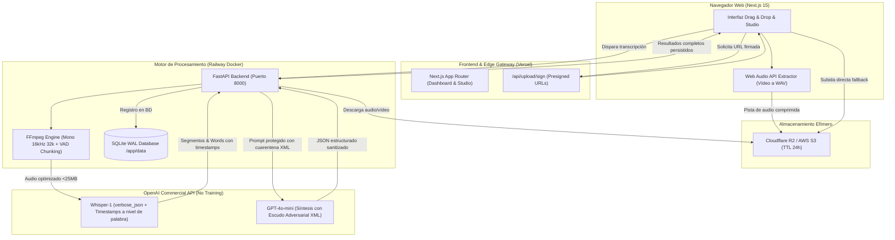

# Transcriptor Enterprise 🎙️⚡

[](https://showcase-portal-rose.vercel.app/#/project/transcriptor/architecture)
[](https://transcriptor-portal.vercel.app)
[](https://transcriptor-backend-production.up.railway.app)
[](https://transcriptor-backend-production.up.railway.app/docs)
[-success?style=flat-square&logo=pytest)](file:///Volumes/OWC%20Envoy%20Ultra/transcriptor/backend/tests)
[](file:///Volumes/OWC%20Envoy%20Ultra/transcriptor/README.md#privacidad-y-gobernanza-de-datos)

Herramienta corporativa integral de alta seguridad para la ingesta, conversión, transcripción y síntesis inteligente de archivos de audio y vídeo mediante la API comercial de OpenAI, optimizada para un stack híbrido de máximo rendimiento: **Vercel Edge + Railway Docker + OpenAI Whisper/GPT-4o-mini**.

---

## 🏛️ Suite de Arquitectura Interactiva (/archify)

El sistema cuenta con la **Suite Canónica Completa de 5 Diagramas Interactivos de Archify**, validados bajo el perfil de calidad **`showcase`** (0 errores, 0 warnings, contraste WCAG AA, renderizado vectorial SVG con temas oscuro/claro y trace motion).

| Diagrama | Descripción | Acceso Interactivo |
| :--- | :--- | :--- |
| 🏛️ **Arquitectura del Sistema** | Topología de microservicios, capas Vercel, Railway, Storage y OpenAI con fronteras de seguridad. | [Ver en Showcase Portal](https://showcase-portal-rose.vercel.app/#/project/transcriptor/architecture) · [Ver HTML Local](docs/architecture/architecture.html) |
| 🔄 **Workflow Operativo** | Flujo orquestado paso a paso por carriles: Cliente, Edge Gateway, Motor Railway y OpenAI. | [Ver en Showcase Portal](https://showcase-portal-rose.vercel.app/#/project/transcriptor/workflow) · [Ver HTML Local](docs/architecture/workflow.html) |
| ⏱️ **Secuencia Temporal** | Tiempos de vida, concurrencia, activaciones y llamadas síncronas/asíncronas en el pipeline. | [Ver en Showcase Portal](https://showcase-portal-rose.vercel.app/#/project/transcriptor/sequence) · [Ver HTML Local](docs/architecture/sequence.html) |
| 🌊 **Flujo de Datos y Pipeline** | Transformación física de vídeo/audio a 16kHz 32k, chunking VAD, tokens y síntesis estructurada. | [Ver en Showcase Portal](https://showcase-portal-rose.vercel.app/#/project/transcriptor/dataflow) · [Ver HTML Local](docs/architecture/dataflow.html) |
| 🔁 **Ciclo de Vida del Trabajo** | Máquina de estados formal: Ingesta, Extracción, Whisper, Minuta, Completado y Error con SQLite WAL. | [Ver en Showcase Portal](https://showcase-portal-rose.vercel.app/#/project/transcriptor/lifecycle) · [Ver HTML Local](docs/architecture/lifecycle.html) |

> 🌐 **Portal Central de Arquitectura:** Explora todos los diagramas unificados en el [SYSTEMSFLIX Showcase Hub](https://showcase-portal-rose.vercel.app/#/project/transcriptor/architecture).

---

## 🚀 Capacidades de Producción

### 1. Ingesta Inteligente y Bypass Serverless (Web Audio API)
- **Extracción de audio en el navegador del cliente:** Si el usuario sube un vídeo 4K de 1 GB, la API Web Audio de Next.js decodifica y extrae exclusivamente la pista de audio antes de transferir nada a la red.
- **Reducción del 95% en ancho de banda:** El payload enviado al backend pasa de **1 GB a ~20-30 MB**.
- **Presigned URLs (S3 / Cloudflare R2):** Transferencia directa a almacenamiento en la nube eludiendo el límite de 4.5 MB de Vercel Serverless.

### 2. Motor de Audio Profesional (FFmpeg en Railway)
- **Compresión optimizada para voz:** Normalización de canales a **Mono 16 kHz a 32 kbps**, reduciendo 1 hora de reunión a tan solo **~14 MB** (el 90% de las reuniones no requieren fragmentación ya que caben holgadamente bajo el límite de 25 MB de OpenAI).
- **Smart Chunking con VAD (Voice Activity Detection):** Para audios mayores a 2 horas, detecta silencios naturales (`silencedetect`) y corta en pausas de conversación sin truncar oraciones a mitad de palabra, recalculando los timestamps de manera continua.

### 3. Síntesis y Minuta IA Multimodelo (4 Plantillas Especializadas)
Generación de análisis de alta fidelidad mediante `gpt-4o-mini` con soporte para 4 plantillas contextuales seleccionables:
- 📋 **Reuniones y Acuerdos:** Minuta ejecutiva formal, decisiones adoptadas y matriz de acuerdos y compromisos (responsable, plazo y entregable).
- 📝 **General:** Síntesis balanceada con resumen estructurado, puntos principales, notas clave y conclusiones generales.
- 🎙️ **Podcast y Entrevistas:** Resumen editorial dinámico, temas clave con marcas temporales estimadas, citas memorables y conclusiones inspiradoras.
- ⚖️ **Interrogatorios y Legal:** Síntesis procesal y cronología de hechos verificados, declaraciones clave por interviniente, análisis de contradicciones o consistencias, y puntos abiertos para investigación.

### 4. Blindaje Adversarial (Prompt Injection Defense & Auto-Repair)
- **Cuarentena XML `<TRANSCRIPCION_ORIGINAL>`:** El contenido transcrito se aísla herméticamente en etiquetas XML neutras con instrucciones explícitas al modelo de tratar el texto exclusivamente como datos pasivos, bloqueando ataques de *jailbreak* o comandos inyectados por voz que busquen manipular la salida.
- **Formato JSON Estricto y Sanitización de Codeblocks:** Limpieza automática de markdown ````json ... ```` y reparador heurístico para corregir JSON truncado por límites de tokens o comas finales huérfanas.
- **Fallback Estructurado Resiliente:** En caso de respuestas anómalas, el pipeline garantiza un objeto JSON conforme al contrato de API para evitar caídas de la interfaz.

### 5. Persistencia Robusta y Recuperación de Sesión (SQLite WAL)
- **Motor SQLite en Modo WAL (`PRAGMA journal_mode=WAL`):** Conexiones optimizadas con transacciones atómicas para lectura y escritura simultánea de alto rendimiento en `/app/data/transcriptions.db`.
- **Persistencia de Trabajos y Metadatos:** Los trabajos, marcas temporales a nivel de palabra, resúmenes y parámetros se persisten en base de datos.
- **Restauración Automática en Frontend:** Si el usuario recarga la página o se desconecta temporalmente, la interfaz recupera el trabajo activo desde `localStorage` y valida el estado en tiempo real contra el backend vía polling con retroceso exponencial.

### 6. Studio Interactivo de Transcripción
- **Reproductor Sincronizado Tipo Karaoke:** Resaltado de palabras activas en tiempo real al compás de la reproducción de audio, permitiendo saltar a cualquier punto con solo hacer clic en una palabra.
- **Búsqueda Dinámica:** Localización instantánea de términos dentro de la transcripción con conteo de coincidencias y navegación rápida.
- **Edición en Línea:** Corrección in situ de nombres propios o tecnicismos directamente en la tabla de segmentos.
- **Exportación Multi-Formato:** Descarga con un solo clic en formatos profesionales:
  - **`.SRT`**: SubRip para Adobe Premiere, DaVinci Resolve y Final Cut Pro.
  - **`.VTT`**: WebVTT para reproductores web y LMS.
  - **`.TXT`**: Texto plano con párrafos limpios por pausas de conversación.
  - **`.JSON`**: Datos completos con timestamps a nivel de palabra y segmento.
  - **`.MD`**: Minuta y acuerdos formateados en Markdown corporativo.

---

## 🏗️ Diagrama de Flujo del Sistema



---

## 📦 Estructura del Proyecto

```
transcriptor/
├── backend/
│   ├── audio_processor.py   # Motor FFmpeg, compresión a 32kbps y VAD silence chunking
│   ├── transcriber.py       # Cliente Whisper con verbose_json y alineación temporal
│   ├── summarizer.py        # Motor de síntesis multimodelo con blindaje adversarial XML
│   ├── database.py          # Capa de persistencia SQLite en modo WAL y transacciones
│   ├── storage.py           # Cliente S3 / Cloudflare R2 con Presigned URLs
│   ├── config.py            # Configuración de entorno Pydantic Settings
│   ├── main.py              # Endpoints FastAPI, validación de schemas y background tasks
│   ├── Dockerfile           # Imagen Docker optimizada con FFmpeg para Railway
│   ├── railway.json         # Configuración de despliegue en Railway
│   ├── requirements.txt     # Dependencias Python
│   └── tests/               # 21 tests unitarios y de integración con pytest
├── frontend/
│   ├── app/
│   │   ├── page.tsx         # Orquestador del flujo, control de plantillas y recuperación
│   │   ├── layout.tsx       # Layout principal Next.js
│   │   └── globals.css      # Estilos Tailwind CSS
│   ├── components/
│   │   ├── Navbar.tsx       # Barra de navegación con estado de conexión y seguridad
│   │   ├── UploadZone.tsx   # Dropzone con selector de idioma, glosario y plantilla
│   │   ├── ProgressTracker.tsx # Barra de progreso con etapas animadas
│   │   └── TranscriptionStudio.tsx # Studio con karaoke interactivo, edición y exportación
│   ├── lib/
│   │   ├── audioExtractor.ts # Extractor cliente con Web Audio API
│   │   └── types.ts         # Tipos TypeScript compartidos y definiciones de plantillas
│   └── package.json
├── docs/
│   └── architecture/        # Suite canónica de 5 diagramas interactivos Archify
│       ├── architecture.html / .json # Arquitectura general del sistema
│       ├── workflow.html     / .json # Workflow operativo por carriles
│       ├── sequence.html     / .json # Secuencia temporal y tiempos de vida
│       ├── dataflow.html     / .json # Flujo de datos y transformaciones
│       └── lifecycle.html    / .json # Ciclo de vida y máquina de estados
└── README.md
```

---

## 🛠️ Guía de Ejecución en Local

### 1. Requisitos Previos
- **Node.js** >= 18
- **Python** >= 3.11
- **FFmpeg** instalado localmente (`brew install ffmpeg` en macOS o `sudo apt install ffmpeg` en Linux)

### 2. Levantar el Backend (FastAPI)
```bash
# Crear entorno virtual e instalar dependencias
uv venv .venv --python 3.12
source .venv/bin/activate
uv pip install -r backend/requirements.txt

# Configurar variables de entorno
cp backend/.env.example backend/.env
# Configura OPENAI_API_KEY en backend/.env

# Ejecutar el servidor backend
cd backend
python -m uvicorn main:app --reload --port 8000
```
La documentación OpenAPI interactiva estará disponible en: `http://localhost:8000/docs`

### 3. Levantar el Frontend (Next.js)
```bash
cd frontend
npm install
npm run dev
```
La aplicación web estará disponible en: `http://localhost:3000`

### 4. Ejecutar la Suite de Tests
```bash
PYTHONPATH=backend .venv/bin/pytest backend/tests/ -v
```
*Cobertura: 21 tests unitarios y de integración verificando extracción de audio, segmentación VAD, blindaje adversarial, serialización de formatos y persistencia SQLite.*

---

## 🚢 Despliegue en Producción

### Frontend en Vercel
1. Conecta el repositorio en Vercel y establece el **Root Directory** en `frontend`.
2. Configura las variables de entorno en Vercel:
   - `NEXT_PUBLIC_BACKEND_URL`: `https://transcriptor-backend-production.up.railway.app`
3. Despliega. Vercel optimizará y distribuirá el frontend en su Edge Network global.
- **URL Activa:** [transcriptor-portal.vercel.app](https://transcriptor-portal.vercel.app)

### Backend en Railway
1. Conecta el repositorio en Railway apuntando a `backend/` con `Dockerfile`.
2. Configura las variables de entorno en el panel de Railway:
   - `OPENAI_API_KEY`: Clave corporativa de OpenAI.
   - `PORT`: `8000`
   - `CORS_ORIGINS`: `https://transcriptor-portal.vercel.app,http://localhost:3000`
   - *(Opcional)* Credenciales S3 / Cloudflare R2 para transferencias directas de archivos grandes.
3. Asigna un volumen persistente montado en `/app/data` para preservar la base de datos `transcriptions.db` entre despliegues.
- **URL Activa:** [transcriptor-backend-production.up.railway.app](https://transcriptor-backend-production.up.railway.app)

---

## 🔒 Privacidad y Gobernanza de Datos

1. **Uso Exclusivo de API Comercial de OpenAI:** Las peticiones a través de la API comercial no se utilizan para entrenar ni mejorar los modelos de OpenAI según sus términos contractuales.
2. **Ciclo de Vida Efímero en Servidor:** Todos los archivos de audio y vídeo procesados en el contenedor de Railway se eliminan automáticamente del disco tan pronto como se completa la transcripción.
3. **TTL de Almacenamiento:** Para cargas mediante buckets S3 o Cloudflare R2, se establece una política de ciclo de vida con eliminación estricta a las 24 horas.
4. **Blindaje contra Inyección de Prompts:** La transcripción se procesa en un entorno de cuarentena semántica para evitar que contenido malicioso introducido por voz tome el control de la generación de minutas o comprometa los sistemas internos.
